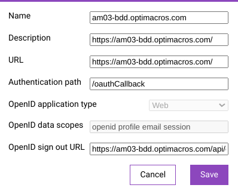

# Чистая установка Application Manager (AM) на клиентский сервер:

Application Manager для своей установки должен взаимодействовать с рабочим Логин центром Optimacros версии 1.6 и выше, а
 также должен быть установлен на отдельном сервере от ЛЦ.

## Действия, которые необходимо сделать в логин центре к которому мы подключаем устанавливаемый АМ:

Входим в ЛЦ с которым мы настроим взаимодействие нового устанавливаемого нами АМ.


Переходим в раздел Application Manager


Нажимаем на кнопку `Add New`, чтобы добавить новый АМ.


Заполняем форму добавления нового АМ и нажимаем `Save`



Обращаем внимание на id нового добавленного АМ в адресной строке (понадобится в дальнейшем для заполнения env файла АМ 
для поля: OAUTH_CLIENT_ID)


Обращаем внимание на token нового добавленного АМ (понадобится в дальнейшем для заполнения env файла АМ 
для поля: OAUTH_CLIENT_SECRET)


Завершающим этапом будет approve АМ внутри ЛЦ, по аналогии как мы делаем и при добавлении новых воркспейсов в ЛЦ.


На этом заканчиваем со всеми необходимые действия, которые необходимо проделать в ЛЦ для добавления нового АМ и 
переходим непосредственно к установке АМ.

## Действия, которые необходимо сделать на сервере для установки АМ и подключения его к нашему логин центру:
Подключаемся к серверу через ssh протокол.

Переходим в аккаунт root с помощью команды `sudo su`


Создаем необходимые нам директории для установки АМ:

В данном случае, для примера, мы решили использовать директорию /opt/ 

Переходим в нее с помощью команды `cd /opt`

B ней создаем директорию ax с помощью команды `mkdir ax`

Переходим в неё с помощью команды `cd ax`

И затем в ней создаем директорию `mkdir application-manager`


Затем скачиваем дистрибутив AM через терминал с помощью команды:

`wget ссылкуНеобходимоЗапроситьУТехническогоОтделаOptimacros/download -O ИМЯ_ФАЙЛА.С_РАСШИРЕНИЕМ`


Далее нам необходимо установить на сервере docker. Устанавливаем его, следуя инструкции из его официального сайта:

https://docs.docker.com/engine/install/ubuntu/

Версия docker не имеет принципиального значения (в отличие от версии vagrant необходимой для Воркспейса), устанавливаем
самую актуальную на момент установки.

Теперь, когда мы подготовили папку для установки AM и скачали дистрибутив, нам необходимо будет установить его
в созданную папку. Для этого переходим в директорию со скачанным ранее дистрибутивом с помощью команды `cd /opt/ax/`.
Выдаём файлу права с помощью команды `chmod +x application-manager-версия.sh` и запускаем инсталлятор с помощью команды
`./application-manager-версия.sh` 


во время установки инсталлятор попросит подтвердить установку AM в дефолтную директорию по пути, которому мы как раз и 
подготовили директории `/opt/ax/application-manager`. Текущая версия инсталлятора устанавливает AM сдефолтными 
настройками подключения, которые нам предстоит настроить вручную, далее нынешняя версия инсталлятора, выдаёт
ошибку со следующим содержимым:


Которая нам говорит о том, что по заданным путям отсутствуют файлы сертификатов. Затем мы переходим в директорию, где
лежит AM `cd /om/application-manager`

Затем мы смотрим содержимое файла .env с помощью команды `cat .env` и видим что там есть только одно свойство VERSION.

Видим, что AM прервал установку на самом начальном этапе, до установки базы данных. Теперь мы можем смело
редактировать .env файл, в соответствии с нашими требованиями (открываем редактирование с помощью команды `nano .env`). 
В частности установить HOSTNAME (хостнейм нашего АМ), NODE_NAME(Его имя в Логин центре), DB_PASSWORD (пароль к базе 
данных), OAUTH_URL(хостней логин центра к которому мы подключаем АМ), OAUTH_CLIENT_ID(id АМ, который выдает ЛЦ при 
добавлении нового АМ в его интерфейсе), OAUTH_CLIENT_SECRET(токен ID, который выдает ЛЦ при добавлении нового АМ в его 
интерфейсе).

```
VERSION="0.3-74-g8877578-develop_0.pr.12_Anton_Zykov_"
NODE_NAME=TEST_AM_03
HOSTNAME=am03-bdd.optimacros.com
DB_USERNAME=applications
DB_PASSWORD=applications
OAUTH_URL=https://bdd-lc.advexcel.tech/
OAUTH_CLIENT_ID=678dd8365b8c080c8756de7
OAUTH_CLIENT_SECRET=78a1176c7280dde64555fdgha25
OAUTH_AUTH_PATH=s/oauth/auth
OAUTH_TOKEN_PATH=s/oauth/token
OAUTH_USERINFO_PATH=s/oauth/me
OAUTH_LOGOUT_PATH=signout
```

Для пароля базы данных (DB_PASSWORD) воспользуемся любым генератором паролей в интернете (http://www.onlinepasswordgenerator.ru/), сгенерировав надёжный пароль длиной более
20 символов (ОЧЕНЬ важно: пароль не должен содержать символов `@:;/\%` это приведёт к багу установки).

После настройки всех пунктов, сохраняем наши изменения в
.env файл.

Затем возвращаемся к нашей проблеме во время установки AM. Переходим в папку с сертификатами с помощью команды
`cd /om/application-manager/data/nginx/cert` После чего, находясь в папке для сертификатов, мы генерируем сами сертификаты
с помощью команды

`openssl req -newkey rsa:2048 -nodes -keyout crt.key -x509 -days 1095 -out bundle.crt`


Отвечаем на вопросы, которые задаст программа генерации. На этом с генерацией сертификатов мы заканчиваем.

Затем мы переходим снова в папку с инсталлятором AM с помощью команды: `cd /opt/am` и запускаем инсталлятор
`./application-manager-версия.sh`

Во время установки на вопрос, нужно ли перезаписывать env файл конечно же отвечаем нет. Ожидаем процесс установки.


Затем увидим вот такую консоль, это значит что AM успешно установлен.


Дожидаемся окончания установки и на этом все.

Можно проверять результат установки в браузере введя имя хоста нашего AM.

[Вернуться к содержанию <](contents.md)

[Вернуться к оглавлению <<](index.md)
