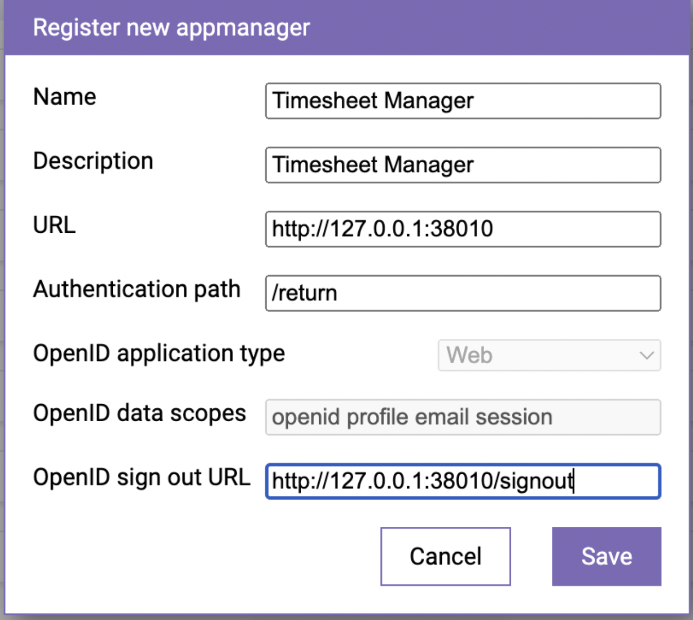
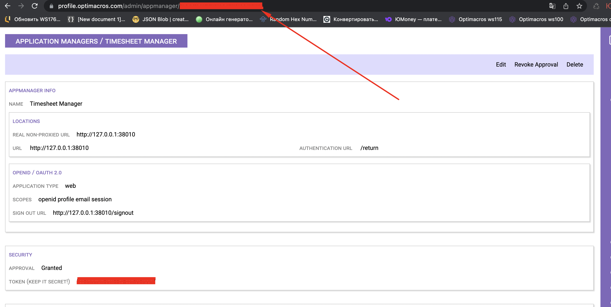
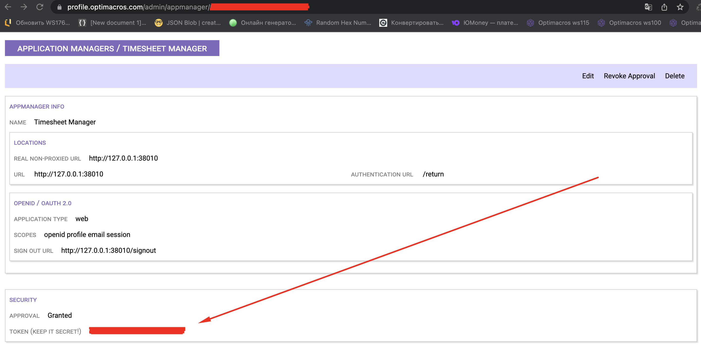
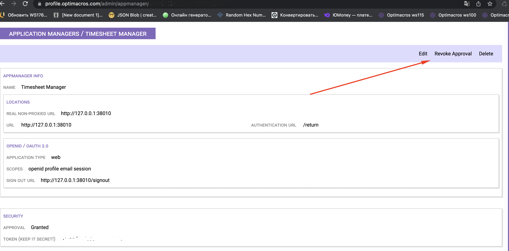

# Чистая установка Time Sheet Manager (TSM) на клиентский сервер:

TSM для своей установки должен взаимодействовать с рабочим Логин центром Optimacros версии 1.6 и выше, а
также должен быть установлен на отдельном сервере от ЛЦ. В целом установка TSM ничем не отличается от установки 
[Application Manager](cleanInstallationAm.md)

## Действия, которые необходимо сделать в логин центре к которому мы подключаем устанавливаемый АМ:

Входим в ЛЦ с которым мы настроим взаимодействие нового устанавливаемого нами TSM.

Все точно также как с AM, поэтому ереходим в раздел Application Manager

Нажимаем на кнопку `Add New`, чтобы добавить новый TSM.

Заполняем форму добавления нового TSM и нажимаем `Save`

Обращаем внимание на id нового добавленного TSM в адресной строке (понадобится в дальнейшем для заполнения env файла TSM
для поля: OAUTH_CLIENT_ID)

Обращаем внимание на token нового добавленного АМ (понадобится в дальнейшем для заполнения env файла TSM
для поля: OAUTH_CLIENT_SECRET)

Завершающим этапом будет approve АМ внутри ЛЦ, по аналогии как мы делаем и при добавлении новых воркспейсов в ЛЦ.

На этом заканчиваем со всеми необходимые действия, которые необходимо проделать в ЛЦ для добавления нового АМ и
переходим непосредственно к установке АМ.

## Действия, которые необходимо сделать на сервере для установки TSM и подключения его к нашему логин центру:
На дынный момент эта информация покрыта мраком и тайной, как только появится инфрмация мы дополним статью. Пока известно
только то, что TSM это приложение Windows.

[Вернуться к содержанию <](contents.md)

[Вернуться к оглавлению <<](index.md)
