# Подробное описание Цветовых схем и интерфейсов:

Для установок цветовых схем и интерфейсов используются флаги в файле манифеста:

## Интерфейс:

```
{
  "container": {
    "ip": "10.0.3.15",
    "cpu": 6,
    "memory": 33685016576,
    "ports": {},
    "hosts": {}
  },
  "workspace": {
    "id": "8522aedecc6b4219ee87ee28",
    "name": "TEST",
    "web": {
      "url": "https://om.test.workspace.ru"
    },
    "loginCenter": {
      "url": "https://lc.company.ru/",
      "token": "4aed337a0ac34dd13716c476a4c7",
      "apiUrl": "wss://lc.company.ru/api/ws/v1/"
    },
    "admin": {
      "email": "admin@optimacros.com"
    },
    "console": {
      "commands": {
        "frontend-build": {
          "appConfig": {
            "flags": [ <= Флаги
                "fun_loader_message_off", // отключает "веселые" сообщения при первичной загрузке
                "interface_theme_optimacros", // интерфейс с тайтлом Optimacros и своим фавиконом
                "color_scheme_advexcel", // цветовая схема advexcel доступна для выбора в настройках (первая в списке дефолтная)
                "color_scheme_optimacros", // цветовая схема optimacros доступна для выбора в настройках
                "color_scheme_olapsoft", // цветовая схема olapsoft доступна для выбора в настройках
                "color_scheme_corplan", // цветовая схема corplan доступна для выбора в настройках
                "color_scheme_orange", // цветовая схема orange доступна для выбора в настройках
                "interface_language_RU", // русский язык доступен для выбора в настройках
                "interface_language_EN", // английский язык доступен для выбора в настройках
                "support_email_support@optimacros.com", // email для связи support@optimacros.com
            ]
          }
        }
      }
    }
  }
}

```

На данном примере, первой установлен интерфейс optimacros, с помощью свойства `interface_theme_optimacros`

Типов интерфейсов на данный момент существует всего три: Optimacros, Olapsoft, Advexcel. Устанавливаются они с помощью 
добавления свойств: interface_theme_optimacros, interface_theme_olapsoft, interface_theme_advexcel соответственно.
Сама по себе тип интерфейса, изменяет основной логотип приложения, допустим при выборе моделей в драйвлендинге можно 
увидеть логотип, меняется фавикон на табах в браузере и копирайты (в подвале) в самом низу приложения, в котором открыта
 модель. 
 
 !!! Свойство с типом интерфейса должно быть указано в одном экземпляре.
 
  
Логотип моделей в драйвлендинге:

 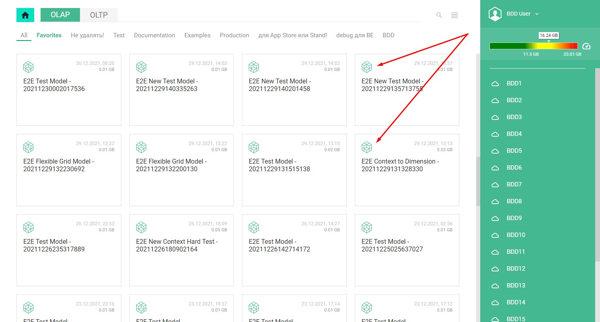


------------------
Фавикон на табе:

 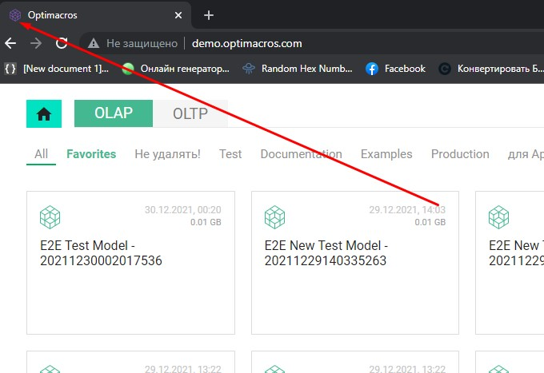


------------------ 
Копирайты в подвале:

 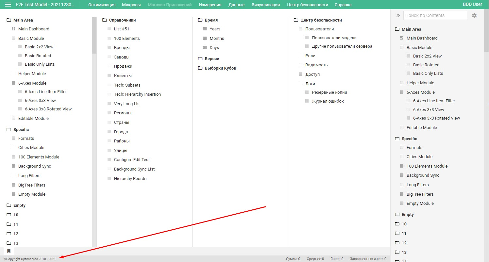
 
## Цветовые схемы:

```
{
  "container": {
    "ip": "10.0.3.15",
    "cpu": 6,
    "memory": 33685016576,
    "ports": {},
    "hosts": {}
  },
  "workspace": {
    "id": "8522aedecc6b4219ee87ee28",
    "name": "TEST",
    "web": {
      "url": "https://om.test.workspace.ru"
    },
    "loginCenter": {
      "url": "https://lc.company.ru/",
      "token": "4aed337a0ac34dd13716c476a4c7",
      "apiUrl": "wss://lc.company.ru/api/ws/v1/"
    },
    "admin": {
      "email": "admin@optimacros.com"
    },
    "console": {
      "commands": {
        "frontend-build": {
          "appConfig": {
            "flags": [ <= Флаги
                "fun_loader_message_off", // отключает "веселые" сообщения при первичной загрузке
                "interface_theme_optimacros", // интерфейс с тайтлом Optimacros и своим фавиконом
                "color_scheme_advexcel", // цветовая схема advexcel доступна для выбора в настройках (первая в списке дефолтная)
                "color_scheme_optimacros", // цветовая схема optimacros доступна для выбора в настройках
                "color_scheme_olapsoft", // цветовая схема olapsoft доступна для выбора в настройках
                "color_scheme_corplan", // цветовая схема corplan доступна для выбора в настройках
                "color_scheme_orange", // цветовая схема orange доступна для выбора в настройках
                "interface_language_RU", // русский язык доступен для выбора в настройках
                "interface_language_EN", // английский язык доступен для выбора в настройках
                "support_email_support@optimacros.com", // email для связи support@optimacros.com
            ]
          }
        }
      }
    }
  }
}

```

На данном примере, установлены цветовые схемы advexcel, optimacros, olapsoft, corplan. Добавляются они с помощью 
добавления в манифест файле свойств в разделе флагов: color_scheme_advexcel, color_scheme_optimacros, 
color_scheme_olapsoft, color_scheme_corplan.

Всего на момент апдейта данного раздела мануала (30.12.2021) в системе существует 10.
Ниже представлены все схемы с названиями и скриншотами того как они выглядят в системе:

### color_scheme_advexcel:

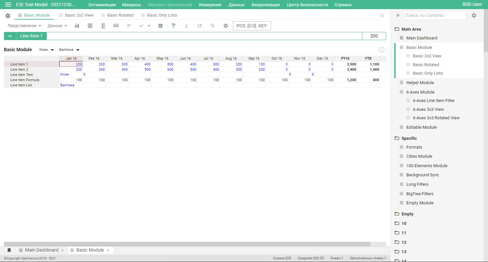

------------------
### color_scheme_optimacros

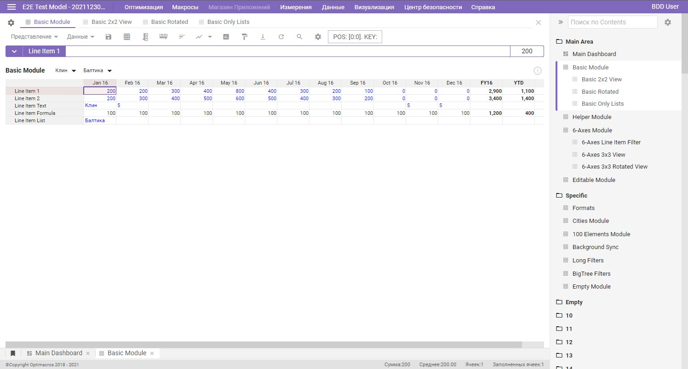

------------------
### color_scheme_olapsoft
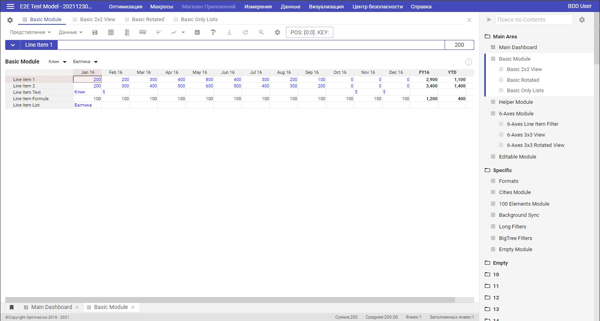

------------------
### color_scheme_corplan
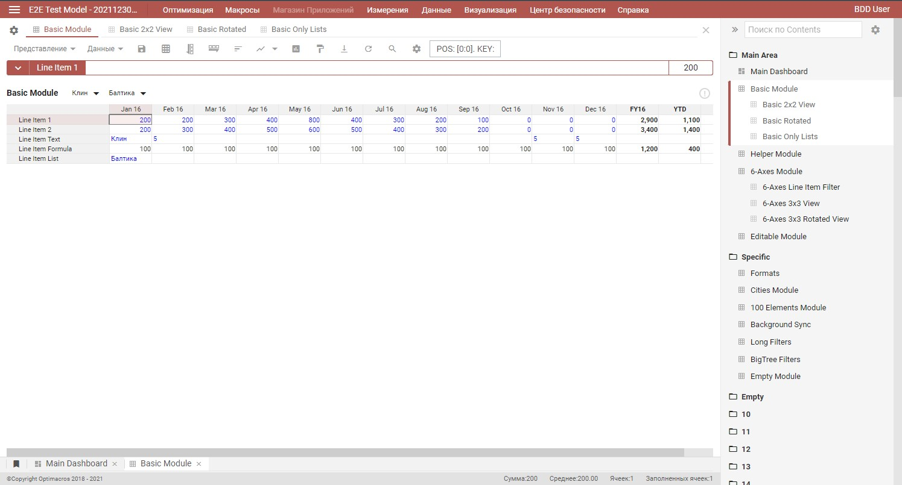

------------------
### color_scheme_ovk
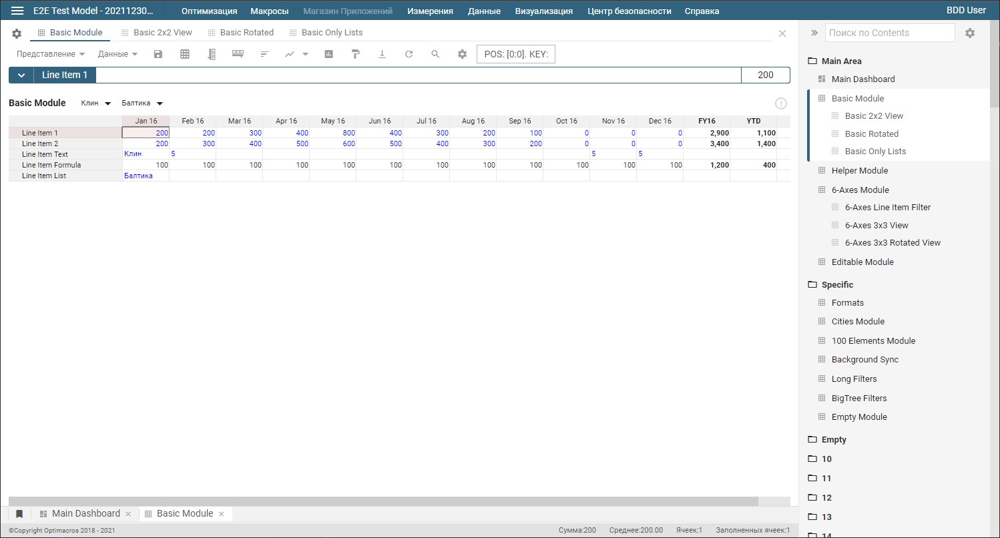

------------------
### color_scheme_tvel
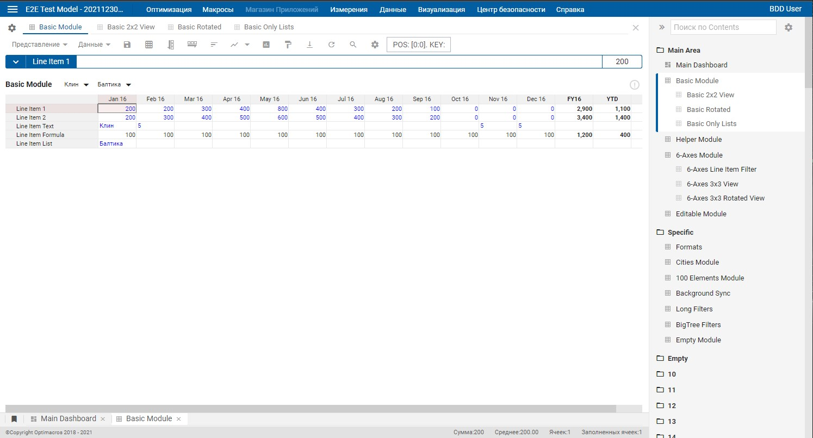

------------------
### color_scheme_orange
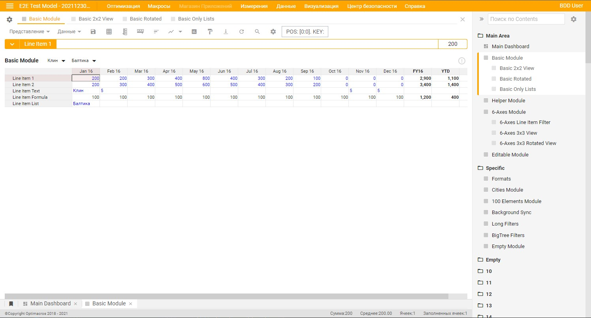

------------------
### color_scheme_dark
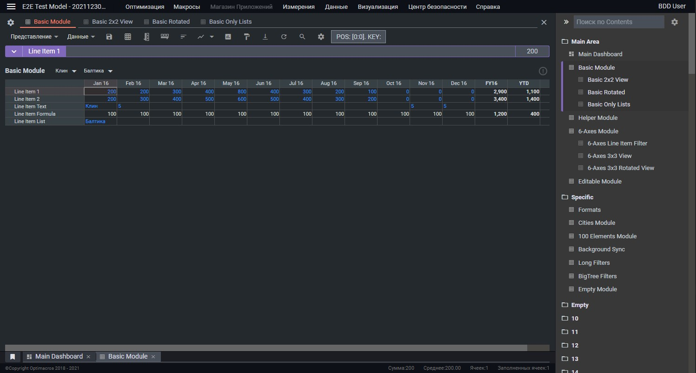

------------------
### color_scheme_domrf
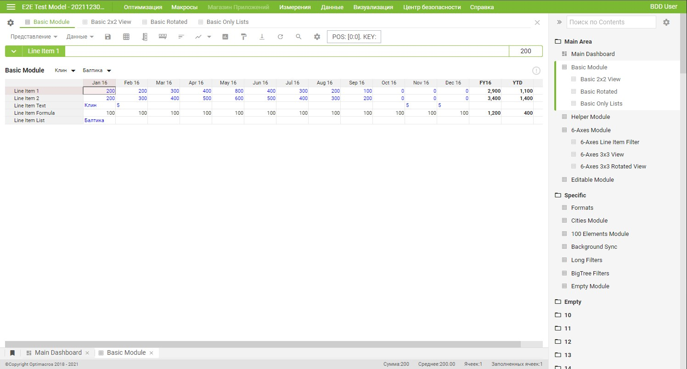

------------------
### color_scheme_fixprice
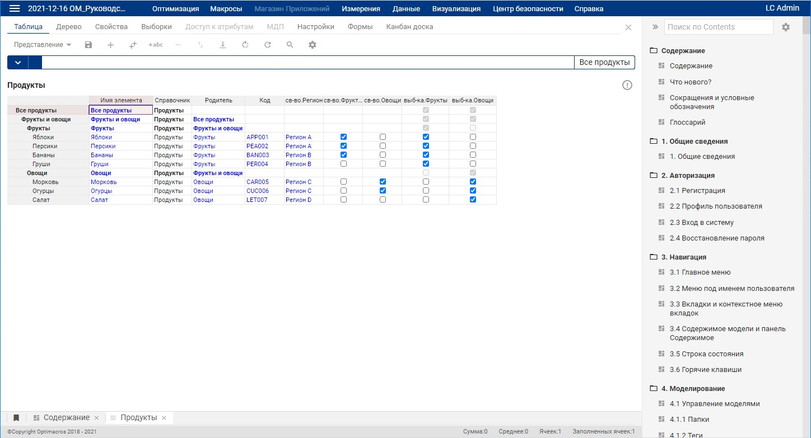

------------------

При добавлении цветовых схем или изменения интерфейсов Optimacros, необходимо обязательно перезагрузить воркспейс.

Подробные руководства по перезагрузке воркспейса, смотрите в содержании.

[Вернуться к содержанию <](contents.md)

[Вернуться к оглавлению <<](index.md)
