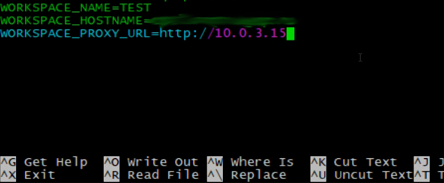

# Настройка Логин Центра и воркспейса, установленных на одном сервере:

При одновременной работе LC и WS, установленный в LC nginx выступает как Reverse Proxy для установленного WS

Сначала устанавливаем Логин Центр и воркспейс, по соответствующим инструкциям в Содержании.

[Чистая установка Логин Центра](cleanInstallationLc.md)

[Чистая установка дистрибутива воркспейса Optimacros](cleanInstallation.md)

После того как мы установили Логин Центра и Воркспейс.
Для начала нам необходимо в Логин Центре в файлике под названием .env, добавить переменную `WORKSPACE_PROXY_URL` и 
указать ей значение: `http://10.0.3.15` (Это тот самый container.ip который мы указывали в файлике manifest.json при 
его заполнении)

Переходим к настройки Reverse Proxy для Воркспейса.

Нам необходимо залить на сервер шаблоны nginx в папку `/om/login-center/data/nginx/templates`

[ws80.conf.template](wsProxyTemplates/ws80.conf.template)
[ws443.conf.template](wsProxyTemplates/ws443.conf.template)
[ws8081.conf.template](wsProxyTemplates/ws8081.conf.template)

Далее нужно добавить сертификат в `/om/login-center/data/nginx/cert/workspace1/bundle.crt` и его ключь в `/om/login-center/data/nginx/cert/workspace1/crt.key`

Затем нам необходимо сделать стоп\старт Логин Центра, перейдя в его root директорию и воспользовавшись утилитой `om`, 
используя команды `./om stop` и затем `./om start`

[Настройка DNS Воркспейса](changeWorkspaceDns.md)

[Вернуться к содержанию <](contents.md)

[Вернуться к оглавлению <<](index.md)