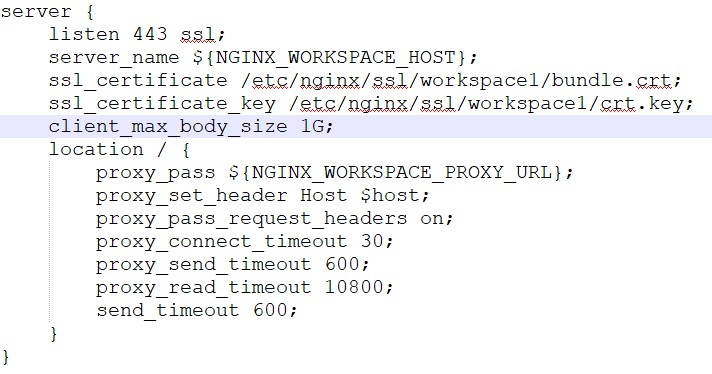
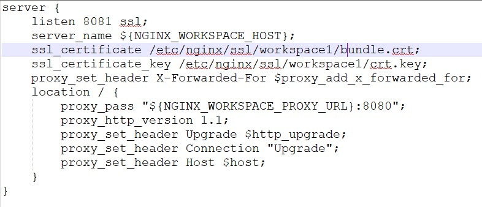

# Настройка Логин Центра и воркспейса, установленных на одном сервере:

Сначала устанавливаем Логин Центр и воркспейс, по соответствующим инструкциям в Содержании.

[Чистая установка Логин Центра](cleanInstallationLc.md)

[Чистая установка дистрибутива воркспейса Optimacros](cleanInstallation.md)

После того как мы установили Логин Центра и Воркспейс.
Для начала нам необходимо в Логин Центре в файлике под названием .env, добавить переменную `WORKSPACE_PROXY_URL` и 
указать ей значение: `http://10.0.3.15` (Это тот самый container.ip который мы указывали в файлике manifest.json при 
его заполнении)


После этого переходим к самому интересному этапу, настройка ssl сертификатов:

Первое что нам нужно сделать это поместить файлы сертификатов от Логин Центра с именами bundle.crt и crt.key по пути: 
`/om/login-center/data/nginx/cert`

Далее нам необходимо залить на сервер templates, чтобы воспользоваться нашими переменными окружения, файлы находятся на 
nextcloud'е:


Если у вас нет доступа в nexcloud запросите эти файлы у тех. специалистов Optimacros.

Скачиваем файлы себе на компьютер для дальнейшего редактирования, исправляя моменты, которые у нас изменились согласно 
окружению и добавляем templates на сервер.

Переходим в терминале в директорию `login-center/data/nginx/templates`

Набираем команду: `nano ws80.conf.template` и вставляем содержимое скачанного темплейта в терминал. 


После чего сохраняем файл.

Так поступаем со всеми файлами темплейтов, а что касается файлов ws443 и ws8081, мы далее следуя нашей инструкции будем 
их дополнительно настраивать. Конфигурация именно этих двух файлов ws443 и ws8081 содержит в себе настройки путей к 
файлам сертификатов для воркспейса. Переходим к их настройке.

Открываем темплейт ws443.conf.template для редактирования, для этого вводим команду: `nano ws443.conf.template`

Важно понимать что пути к файлам ssl сертификатов указанные в строках начинающихся с `ssl_sertificate` это пути к файлам 
сертификатов внутри контейнера. В нашем случае путь внутри контейнера `/etc/nginx/ssl` равен пути на нашем сервере с 
которым мы работаем: `/om/login-center/data/nginx/cert` по этому пути должны располагаться файлы сертификатов для логин
 центра, а если у нас wildcard сертификаты (т.е. один и тот же для ЛЦ и для WS) мы в темплейте пишем пути: 
 /etc/nginx/ssl/bundle.crt и  /etc/nginx/ssl/crt.key соответственно. Если же у нас для воркспейса отдельные файлы 
 сертификатов, то добавим в этих путях ещё директорию в которую мы поместим файлы сертификатов от воркспейса, укажем 
 пути допустим: /etc/nginx/ssl/workspace1/bundle.crt и /etc/nginx/ssl/workspace1/crt.key
 



Аналогичным образом заполняем пути в файле ws8081.conf.template



Соответственно файлы сертификатов от воркспейса должны располагаться у нас на сервере по пути: 
`/om/login-center/data/nginx/cert/workspace1` с именами bundle.crt и crt.key.

Затем нам необходимо сделать стоп\старт Логин Центра, перейдя в его root директорию и воспользовавшись утилитой `om`, 
используя команды `./om stop` и затем `./om start`

С настройкой Логин Центра пока заканчиваем и переходим к настройке файла воркспейса `manifest.json`

В первую очередь, что нам нужно изменить относительно стандартного файла манифеста это свойство `dns` для того, в ОС 
Ubuntu узнать список имеющихся DNS можно воспользоваться командой `system-resolve --status` после чего курсором на 
клавиатуре скроллим вывод команды в самый низ и смотрим список DNS Servers:


То содержимое, которые мы наблюдаем в `DNS Servers:` помещаем в массив объектов с ключом `ip` и текстовым значением DNS
 по пути `container.dns.nameServers` (обязательно соблюдаем порядок перечисления DNS), а то что в `DNS Domain:` помещаем
  в массив строк по пути `container.dns.search` в файле манифеста. Свойство `container` в манифесте будет выглядеть 
  примерно вот так:
  


И так же нужно сконфигурировать свойство dns.

```
"hosts": {
        "адресЛогинЦентра.ru": "IP нашего сервера"
 },
```

После данных настроек файла манифеста, если воркспейс уже был запущен, его нужно остановить и запустить заново с помощью 
последующего выполнения команд:

```/om/workspace-installer/current/install workspace --path /om/workspace1/manifest.json shutdown```  <= остановка 
работы воркспейса

```/om/workspace-installer/current/install workspace --path /om/workspace1/manifest.json up``` <= запуск работы 
воркспейса.

Если воркспейс не был запущен ранее, то просто запускаем его работу.

После последовательно выполнения всех действий из данной инструкции, настройку можно считать завершенной и проверить 
результат работы Optimacros в браузере.

[Вернуться к содержанию <](contents.md)

[Вернуться к оглавлению <<](index.md)
