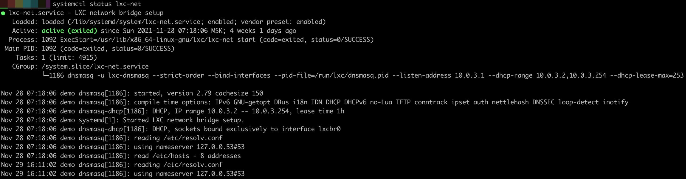

# Принципы работы DNS в LXC контейнере:

## Схема работы:
Для работы LXC сети вместе с LXC устанавливается сервис lxc-net он создает интерфейс-мост (по умолчанию интерфейс имеет
 адрес 10.0.3.1) и управляет DHCP (по умолчанию 10.0.3.2-10.0.3.254) и DNS контейнеров, т.е. из контейнера доступен 
 DNS хост ОС по адресу 10.0.3.1:53

Сам сервис lxc-net основан на утилите dnsmasq

 
 
Как мы видим сервис поднял процесс приложения dnsmasq с настройками
 
Настройки в разных ОС лежат в разных местах, в Ubuntu в `/etc/default/lxc-net` и `/etc/dnsmasq.d/lxc`

## Изменение DNS на хосте:

lxc-net при старте считывает хостовые параметры DNS и данные файла hosts и создаёт на 10.0.3.1:53 DNS сервис используя 
dnsmasq сервис. Этот сервис отдаёт в контейнере резолвинг через ранее прочитанную конфигурацию. Если конфигурация 
меняется, то нужно делать рестарт lxc-net сервиса с хостовой машины, с помощью команды:

`systemctl restart lxc-net`

Это нужно для перезагрузки DNS конфигурации и корректного ее проброса в контейнер. 

[Вернуться к содержанию <](contents.md)

[Вернуться к оглавлению <<](index.md)
