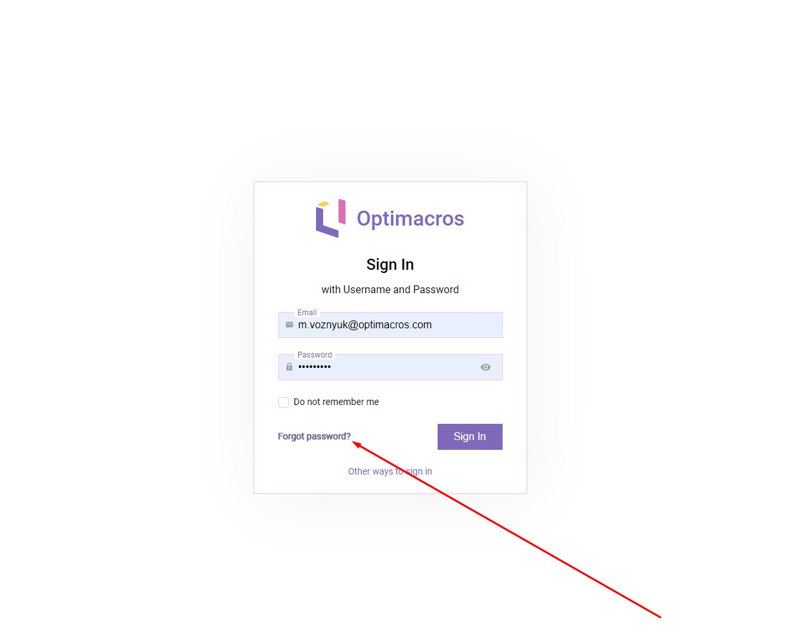
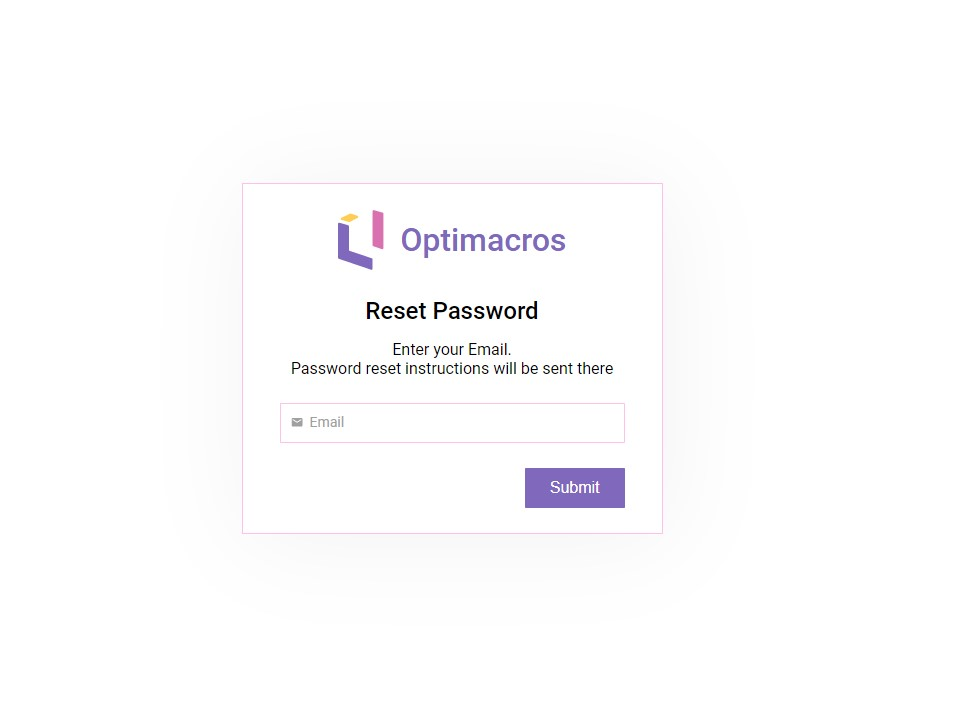
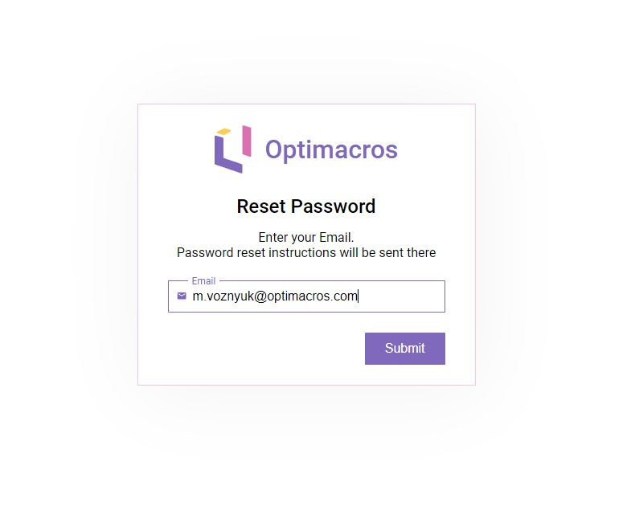
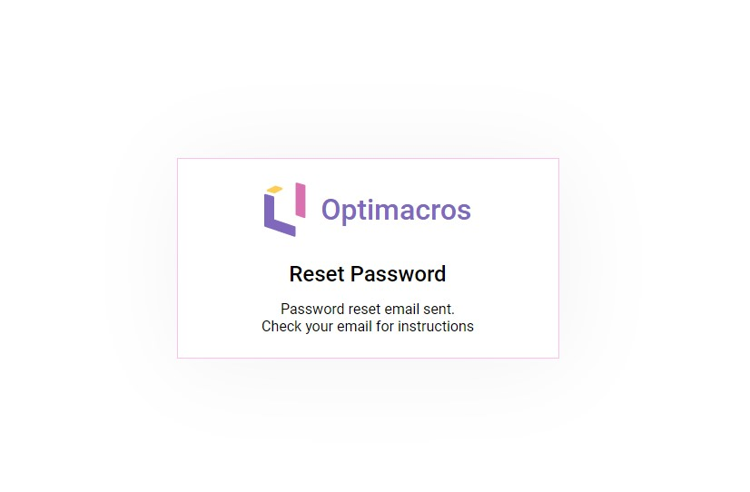
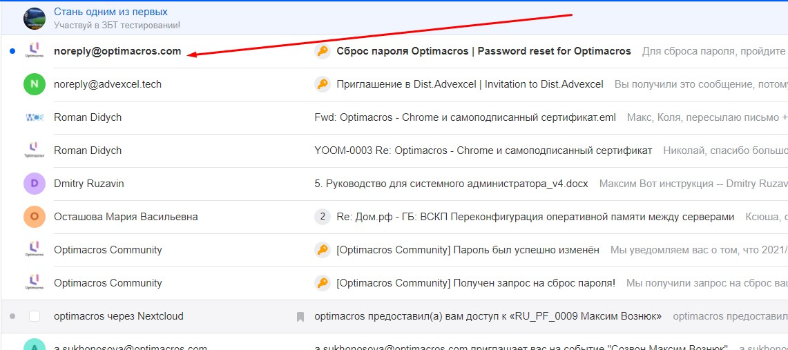
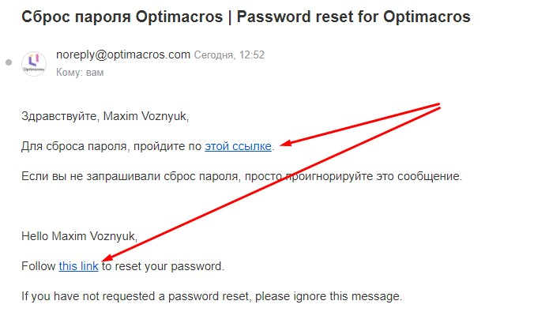
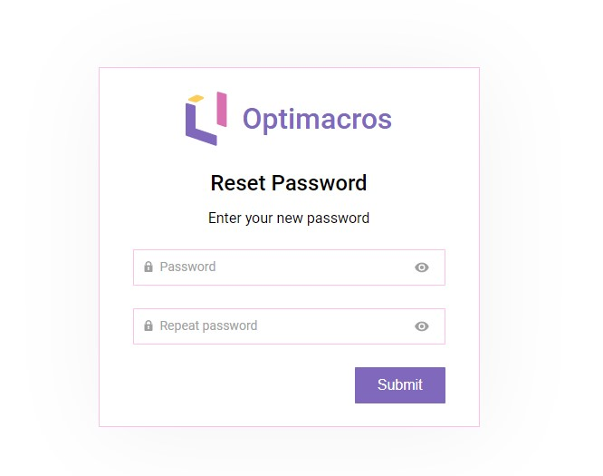

# Восстановление пароля для Логин Центра Optimacros:

В случае утери пароля в Логин Центре Optimacros для пользователей предусмотрена возможность восстановить утерянный
пароль. Для этого нам необходимо на странице Логин Центра нажать на кнопку `Forgot password` см. скриншот ниже:

Далее мы увидим форму, в которой нам необходимо будет ввести свой почтовый ящик:

Заполняем форму:

После нажатия на кнопку `Submit` мы увидим оповещение о том, что на нашу почту отправлено письмо с дальнейшими
 инструкциями.
 

Затем заходим на наш почтовый ящик и проверяем наличие новых писем. Отлично! Мы увидим, что нам пришло новое письмо для
 сброса пароля Optimacros.

Открываем письмо и нажимаем в письме на текст ссылку `этой ссылке` или `this link`.

После этого нам открывается страничка Логин Центра с формой для ввода нового пароля и повторным вводом для
 подтверждения.
 
 

На этом процедура по сбросу пароля завершена. После нажатия на кнопку `Submit` пароль будет изменён на новый.
  
[Вернуться к содержанию <](contents.md)

[Вернуться к оглавлению <<](index.md)