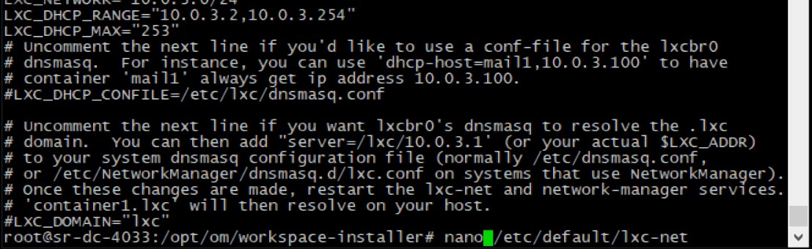
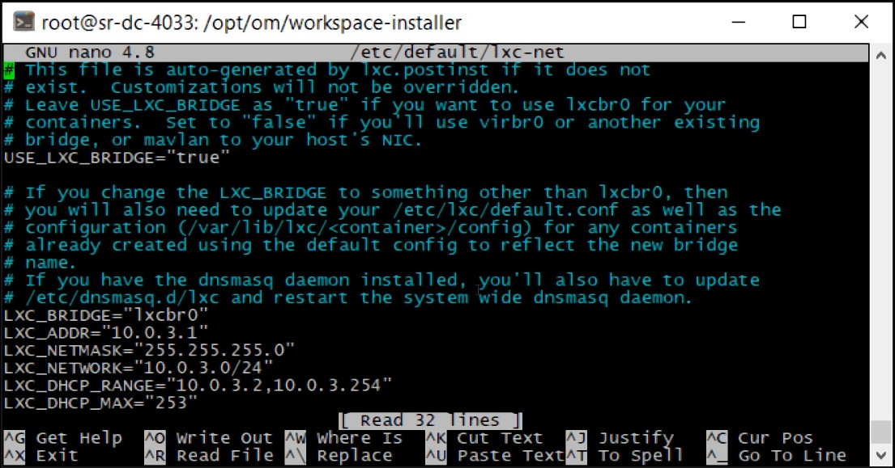
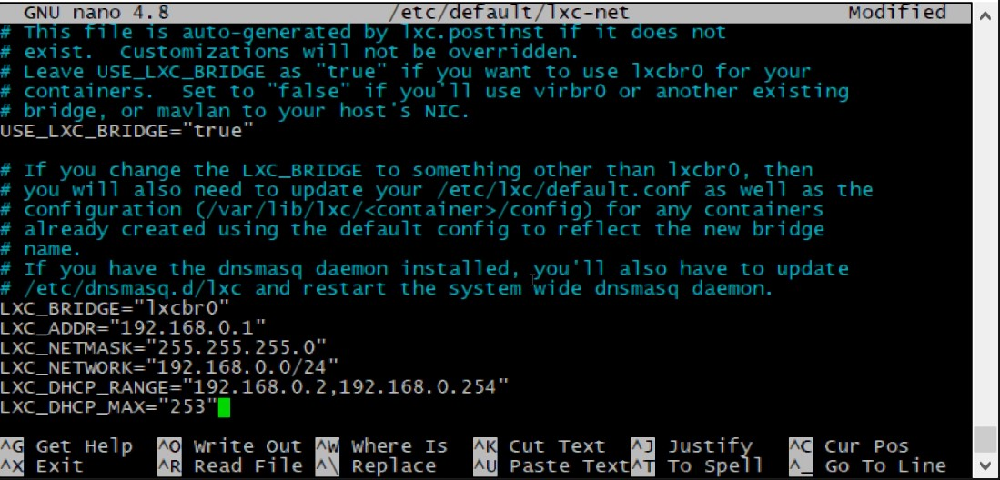
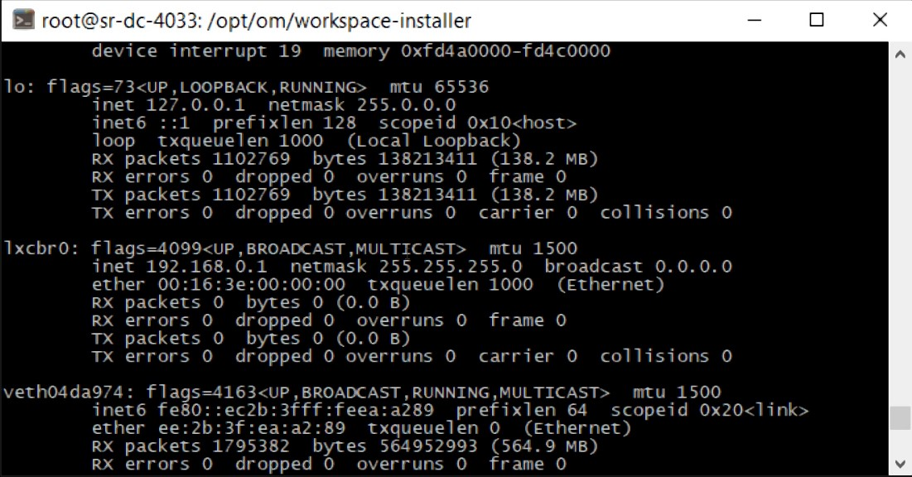
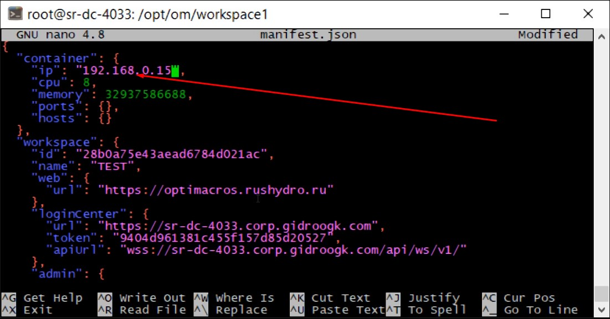
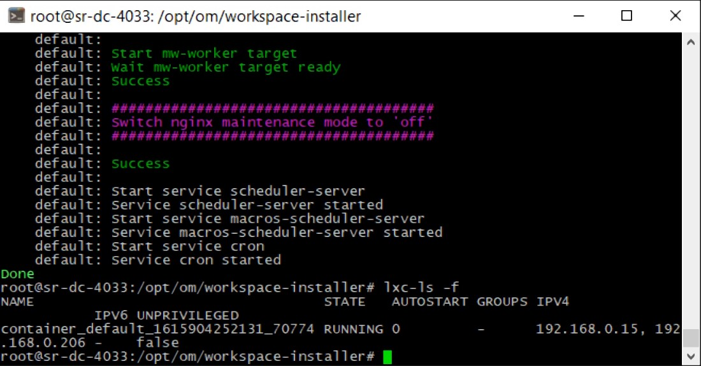

# Инструкция как изменить подсеть LXC

В случае если у нас уже имееется рабочийц воркспейс, то первое, что нужно сделать это остановить работу воркспейса. Это 
можно сделать при помощи команды (более подробная информация по остановке воркспейса смотрите [здесь](refreshWs.md)):
                                                           
```/om/workspace-installer/current/install workspace --path /om/workspace1/manifest.json shutdown```


После чего мы должны отредактировать файл `lxc-net` по пути `/etc/default/`. Для этого воспользуемся командой:

`nano /etc/default/lxc-net`



После чего нам будет доступен файл для редактирования:



Редактируем поля `LXC_ADDR`, `LXC_NETWORK`, `LXC_DHCP_RANGE` изменяем адреса на те которые нам необходимы. Выглядеть это
 будет примерно так: 
 


Сохраняем изменения. После чего нам нужно последовательно воспользоваться командами:

`systemctl restart lxc-net`

`systemctl restart lxc`

После этого вводим команду:

`ifconfig`

И в выводе смотрим на то, как у нас выглядит lxc bridge



IP адрес должен быть таким каким мы указали в поле `LXC_ADDR`.

После этого нам необзодимо открыть манифест файл воркспейса и изменить в нём адрес в самом верхнее поле.

Открываем файл манифеста дял редактирования при помощи команды `nano /om/workspace1/manifest.json` и редактируем:



После этого сохраняем изменения и затем запускаем работу воркспейса. Используем команду: 

```/om/workspace-installer/current/install workspace --path /om/workspace1/manifest.json up```


Дожидаемся такого вывода терминала:


Далее вводим команду `lxc-ls -f`



Видим что у контейнера IP адреса соответствующие.

Затем нам нужно ищзменить ip адрес воркспейса в Логин Центра в .ENV файле. Вводим команду:

`nano /om/login-center/.env`

В файлике .ENV изменяем IP адрес в поле `WORKSPACE_PROXY_URL:` в нашем случае на `192.168.0.15` и созраняем изменения.

И перезагружаем Логин Центр, введя команды последовательно:

`cd /om/login-center/`

`./om stop web`

`./om start web`

На этом мы изменили подсеть LXC

[Вернуться к содержанию <](contents.md)

[Вернуться к оглавлению <<](index.md)
