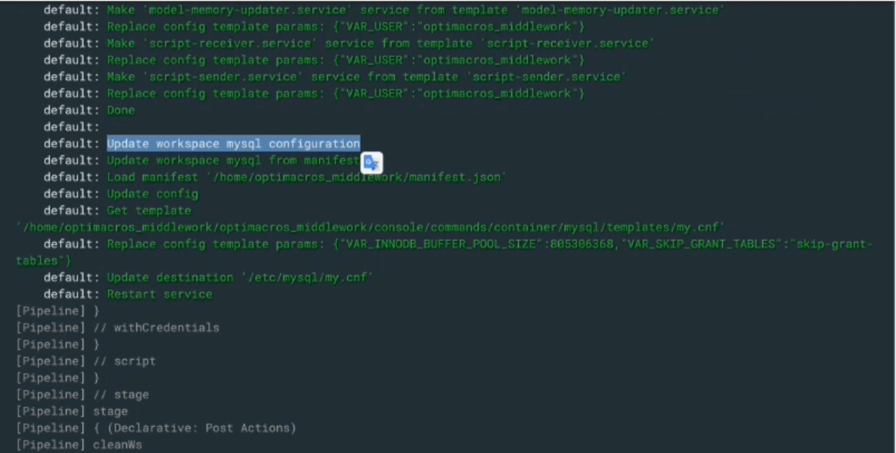
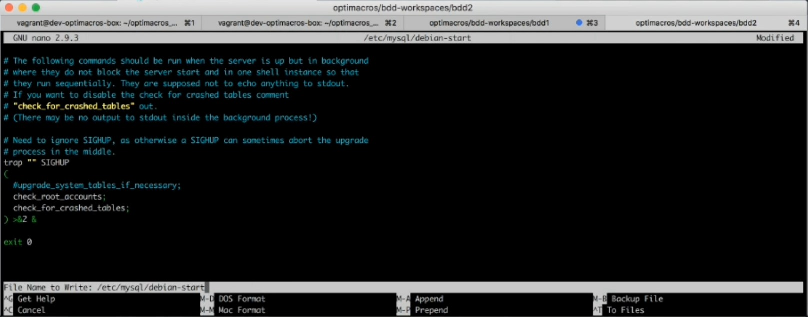
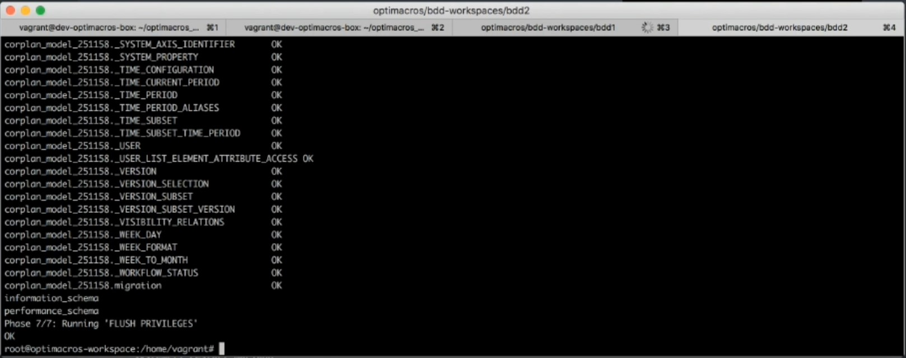
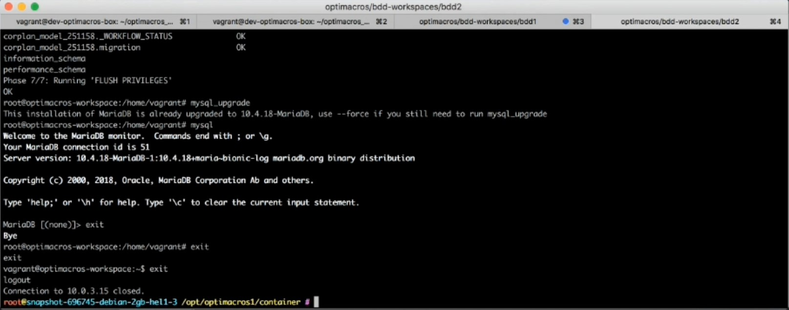

# Экспертиза по проблеме с обновлением Mysql при поднятии воркспейса.

В случаях, когда при поднятии воркспейса происходит прерывание процесса поднятия, после данных этапов:



Это может означать, что при обновлении воркспейса Optimacros возникла проблема автообновления Mysql.
На данный момент воркспейс находится в нерабочем состоянии наполовину поднятым. Порядо действий для устранения проблемы 
следующий:

Первое что нам необходимо сделать после подключения по ssh это перейти в директорию с контейнером с помощью команды:

`cd /opt/om/workspace1`

Затем подключаемся к вагрант контейнеру с помощью команды:

`vagrant ssh`

После чего нам нужно расширить привиллегии до sudo, вводим команду:

`sudo su`

Далее нам нужно отредактировать файл который называется `debian-start` для инициации процесса редактирования вводим:

`nano /etc/mysql/debian-start`


При редактировании файла нам нужно закомментировать в конце файла строчку `upgrade_system_tables_if_necessary`, поставив
 символ `#` перед строчкой. Должно получится как на скриншоте ниже:
 

 
И сохраняем измененения в файле. Теперь нам необходимо перезагрузить сервис `mariadb` для этого введём команду: 

`systemctl restart mariadb`

Выполняем команду:

`mysql_upgrade`



Теперь снова нужно перезагрузить сервис `mariadb` для этого введём команду: 

`systemctl restart mariadb`

После этого нам нужно зайти в Mysql терминал с помощью команды:

`mysql`

И в Mysql терминале нужно выполнить команду:
 
`FLUSH PRIVILEGES;`

Затем выполняем команду сброса пользователя root:

```
ALTER USER `root`@`localhost`

IDENTIFIED VIA mysql_native_password

USING PASSWORD("bPy89eEN8iojjg9Fz49#")

OR unix_socket;
```

Выходим из Mysql терминала с помощью команды:

`exit`

И выполняем снова команду:

`mysql_upgrade`

Видим что апгрейд проходит успешно. После данного этапа повторный ввод команды апгрейда mysql уже не будет отрабатывать,
 а будет упираться в сообщение что апгрейд не нужен. В этом и заключалась вся проблема.
 
Далее выходим из контейнера с помощью команды `exit`



Далее нужно перейти в директорию с нашим инсталятором воркспейса и выполнить штатную остановку воркспейса, но с флагом
`force` т.е. команда будет выглядеть таким образом:

`/opt/om/workspace-installer/current/install workspace --path /opt/om/workspace1/manifest.json shutdown --force`

После этого можно поднимать воркспейс:

`/opt/om/workspace-installer/current/install workspace --path /opt/om/workspace1/manifest.json up`

На этом всё, проблема решена.

[Вернуться к экспертизе <](expertise.md)

[Вернуться к оглавлению <<](index.md)


