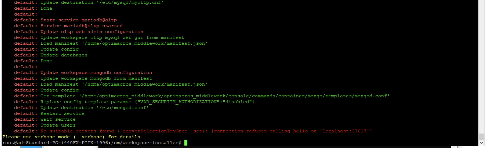
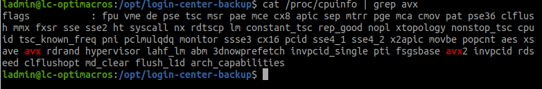

### Падение запуска воркспейса на шаге запуска mongodb

При запуске воркспейса на шаге запуска mongodb происходит падение.

Причиной такого поведение является отсутствие AVX инструкций процессора или отключение их поддержки для виртуальной машины.

Проверка наличия avx 

    cat /proc/cpuinfo | grep avx

В данном случае они присутствуют.

Решение проблемы:
* Включение поддержки интсрукций AVX для виртуальной машины
* Замена сервера на который производится установка на другой с процессором поддерживающим AVX 

[Вернуться к экспертизе <](expertise.md)

[Вернуться к оглавлению <<](index.md)
