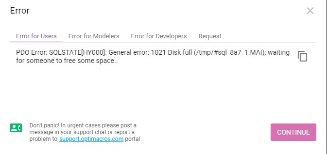

### Проблема с местом на диске в директории которой установлен Воркспейс Optimacros.

При исчерпании места в директории которой установлен воркспейс обычно мы видим подобную ошибку:

Обычно это происходит по ошибке, при установке воркспейса в root директорию Операционной системы, либо просто при 
исчерпании места в директории с воркспейсом. В случае если проблема в том что воркспейс находится в директории с ОС, 
для начала необходимо остановить работу воркспейса при помощи команды:

`/opt/om/workspace-installer/current/install workspace --path /opt/om/workspace1/manifest.json shutdown`

Если этого сделать не удаётся, то можно добавить в конце команды флаг `--force` для форсированной остановки работы 
воркспейса (без автоматического бекапирования всех моделей). После чего можно скопировать целиком директорию с 
воркспейсом обычно она называется workspace1. при помощи команды:
 
`cp -R /opt/om/worspace1 /omNew`
 
!!! Где `/omNew` это раздел на который вы хотите перенести папку и в котором имеется достаточно места, а `/opt/om/` 
это текущее место установки воркспейса optimacros.

Так же можно перенести директорию с установочными дистрибутивами, если она у вас так же находится в root директории, при
 помощи команды:
 
`cp -R /opt/om/workspace-installer /omNew`

!!! Где `/omNew` это раздел на который вы хотите перенести папку и в котором имеется достаточно места, а `/opt/om/` 
это текущее место установки воркспейса optimacros.

После этого вы можете запустить воркспейс из нового места, при помощи команды:

`/omNew/workspace-installer/current/install workspace --path /omNew/workspace1/manifest.json up`

!!! Обратите внимание на то, чтобы вы запускали точно воркспейс находящийся по новому пути. Где `/omNew` это 
раздел на который вы только что перенесли папку с воркспейсом.

После успешного запуска воркспейса вы можете удалить директорию с воркспейсом и установочными дистрибутивами, 
находящуюся по старому пути, при помощи команд:

`rm -rf /opt/om/workspace1/`
`rm -rf /opt/om/workspace-installer/`

!!! Где `/opt/om/` это место старой установки воркспейса optimacros.

[Вернуться к экспертизе <](expertise.md)

[Вернуться к оглавлению <<](index.md)
