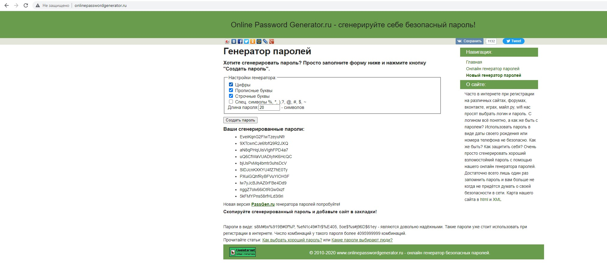
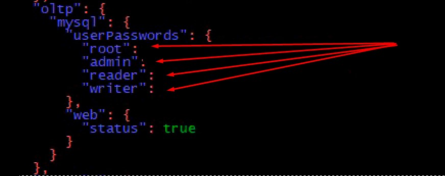
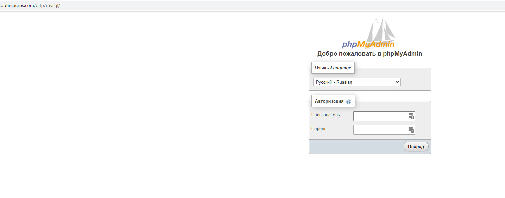

# Подключение и настройка OLTP на воркспейсе Optimacros

Для подключения OLTP на существующем воркспейсе Optimacros, нам нужно модифицировать файл конфигурации воркспейса 
manifest.json. Так же нам нужно сгенерировать пароли длинною 20 символов для 4 пользователей OLTP. Можно воспользоваться
 любым онлайн сервисом например: http://www.onlinepasswordgenerator.ru/

Генерируем пароли длиною в 20 символов:

Далее нам нужно добавить свойства в файлик manifest.json

Для этого перейдём в директорию с воркспейсом с помощью команды:

`cd /om/workspace1/`

И откроем файл manifest для редактирования с помощью команды:

`nano manifest.json`

И в блоке workspace добавляем блок oltp с содержимым как на скриншоте ниже:

В указанные стрелочками места, подставляем сгенерированные нами ранее пароли.

Эти пароли и будут являться паролями доступа к oltp для пользователей с соответствующими ролями.

Далее сохраняем изменения в манифест файлике. И затем чтобы изменения вступили в силу нам потребуется перезагрузить 
воркспейс. Можно воспользоваться инструкцией по перезагрузке: [ссылка на инструкцию](restartWorkspace.md)

После перезагрузки воркспейса, oltp будет доступно в браузере по адресу: https://workspace.com/oltp/mysql

где workspace.com это адрес вашего воркспейса.

Аналитикам для пользования oltp следует выдать пароли от ролей reader и writer. На этом настройка oltp на воркспейсе 
окончена.

[Вернуться к содержанию <](contents.md)

[Вернуться к оглавлению <<](index.md)
