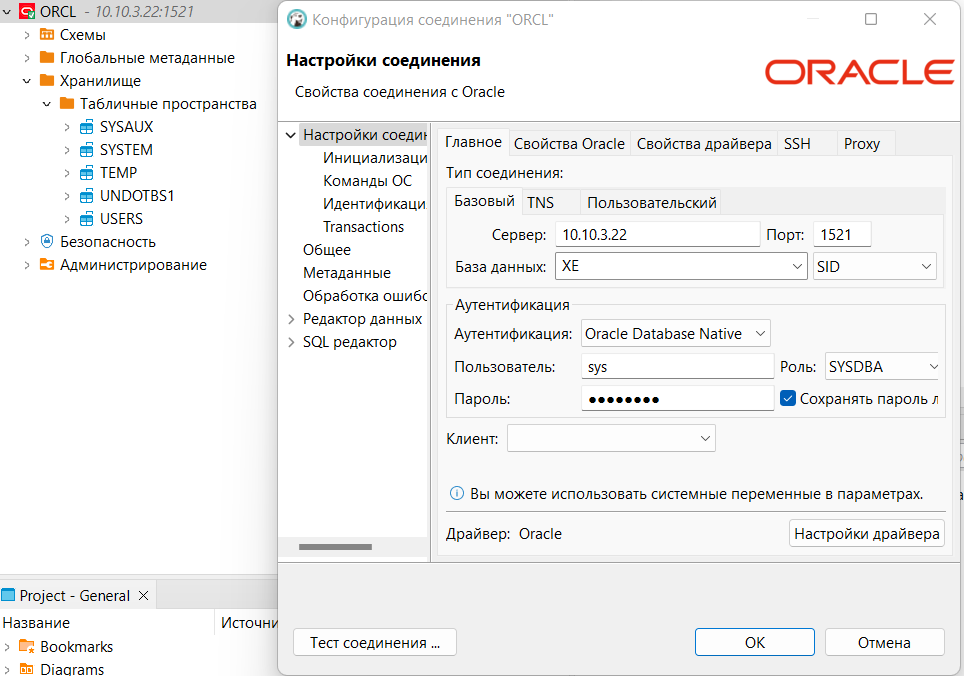

# Установка Oracle

## Требования
Само собой для работы Docker требуется его установить. Идем на сайт docker и выполняем установку под свой дистрибутив.

https://docs.docker.com/engine/install/

После установки можно перенести хранилище образов и контейнеров докера в нужный каталог если есть ограничения на использование корневого раздела [по инструкции здесь](../dockerAndLxcChangeDataFolder.md). 

## Сборка образа

Клонируем репозиторий с докер файлами для сборки

    git clone https://github.com/oracle/docker-images.git

Идем в каталог далее 

    cd docker-images/OracleDatabase/SingleInstance/dockerfiles

И выполняем сборку образа docker с нужной версией и параметрами. [Подробне ..](https://github.com/oracle/docker-images/tree/main/OracleDatabase/SingleInstance)


    ./buildDockerImage.sh -v 18.4.0 -x

В данном случае выполняется сборка докер образа с Oracle Database 18.4.0 XE

По окончании сборки образа можно проверить командой:

    docker images

В списке должен появится новый собранный образ.

```
 $ docker images
REPOSITORY              TAG           IMAGE ID          CREATED           SIZE
oracle/database         18.4.0-xe     6a5a6370de97      1 minute ago       8.57GB 
```

# Запуск контейнера

Для запуска единичного контейнера используем команду

```
$ docker run --name myxedb \
    -d \
    -p 51521:1521 \
    -p 55500:5500 \
    -e ORACLE_PWD=mysecurepassword \
    -e ORACLE_CHARACTERSET=AL32UTF8 \
    oracle/database:18.4.0-xe
```
Параметры запуска
- --name myxedb имя контейнера. Если не указать имя docker генерирует самостоятельно уникальное имя контейнера
- -d запуск в фоновом режиме. 
- -p 51521:1521 и -p 55500:5500 сопоставление портов хост машины и контейнера. Правая часть не меняется. В левой указывается необходимые свободные порты хост машины.
- -e переменные окружения для настройки контейнера
    - ORACLE_PWD=mysecurepassword пароль для  SYS, SYSTEM и PDB_ADMIN
    - ORACLE_CHARACTERSET кодировка для создаваемой базы данных

Созданный образ имеет три основные точки монтирования которые можно при необходимости соеденить с хост системой:
- /opt/oracle/oradata файлы базы данных и ее файлы конфигурации
- /opt/oracle/scripts/setup  каталог, содержащий сценарии оболочки или SQL, которые выполняются один раз после завершения установки (создания) базы данных.
- /opt/oracle/scripts/startup каталог, содержащий сценарии оболочки или SQL, которые выполняются при каждом запуске контейнера

Том данных /opt/oracle/oradata позволяет сохранить данные базы данных и файлы конфигурации в файловой системе хоста на случай удаления контейнера. Каталог должен быть доступен для записи пользователю с UID 54321, который является пользователем oracle в контейнере. Обеспечить это можно двумя способами:

    chown 54321:54321 /home/myuser/Docker/myxedb/oradata;

Или создать каталог с правами для всех 777

```
$ mkdir -p /home/myuser/Docker/myxedb/oradata
$ chmod 777 /home/myuser/Docker/myxedb/oradata
$ docker run --name myxedb \
    ...
    -v /home/myuser/Docker/myxedb/oradata:/opt/oracle/oradata \
    -v /home/myuser/Docker/myxedb/scripts/setup:/opt/oracle/scripts/setup \
    -v /home/myuser/Docker/myxedb/scripts/startup:/opt/oracle/scripts/startup \
    oracle/database:18.4.0-xe
```

## Соединение с базой данных

Для примера скрин из DBeaver



Здесь параметры:
- Сервер: ip адрес сервера хоста
- Порт: порт хост машины сопоставленный с портом контейнера 
- База данных XE для входа под пользователем sys или system, XEPDB1 для входа под пользователем PDB_ADMIN
- Имя пользователя. Для входа под пользователем sys указываем роль SYSDBA
- Пароль. Указываем пароль заданный переменной окружения ORACLE_PWD при запуске контейнера.


для соединения используя sqlplus
```
sqlplus sys/<your password>@//localhost:1521/XE as sysdba
sqlplus system/<your password>@//localhost:1521/XE
sqlplus pdbadmin/<your password>@//localhost:1521/XEPDB1
```


# Запуск через docker compose

В отдельной директории создаем файл docker-compose.yml

```
version: "3.7"

services:
  oracle:
    image: oracle/database:18.4.0-xe
    container_name: oracle_db
    volumes:
      - /oracle_db/oradata:/opt/oracle/oradata 
      - /oracle_db/scripts/setup:/opt/oracle/scripts/setup 
      - /oracle_db/scripts/startup:/opt/oracle/scripts/startup 
    ports:
      - "1521:1521"
      - "5500:5500"
    env_file:
      - .env
```

и файл .env
```
ORACLE_PWD=mysecurepassword 
ORACLE_CHARACTERSET=AL32UTF8 
```

Переменные можно не выносить в отдельный файл указав их в docker-compose.yml файле. Для этого заменяем секцию env_file на
```
    environment:
      - ORACLE_PWD=mysecurepassword 
      - ORACLE_CHARACTERSET=AL32UTF8 
```

После этого требуется создать каталог для монтирования каталогов контейнера. 

```
mkdir oracle_db
chown 54321:54321 oracle_db

```

запуск контейнера в фоновом режиме выполняется командой 

    docker compose up -d

остановка по команде

    docker compose down

[Вернуться к содержанию <](index.md)

[Вернуться к оглавлению <<](../index.md)
