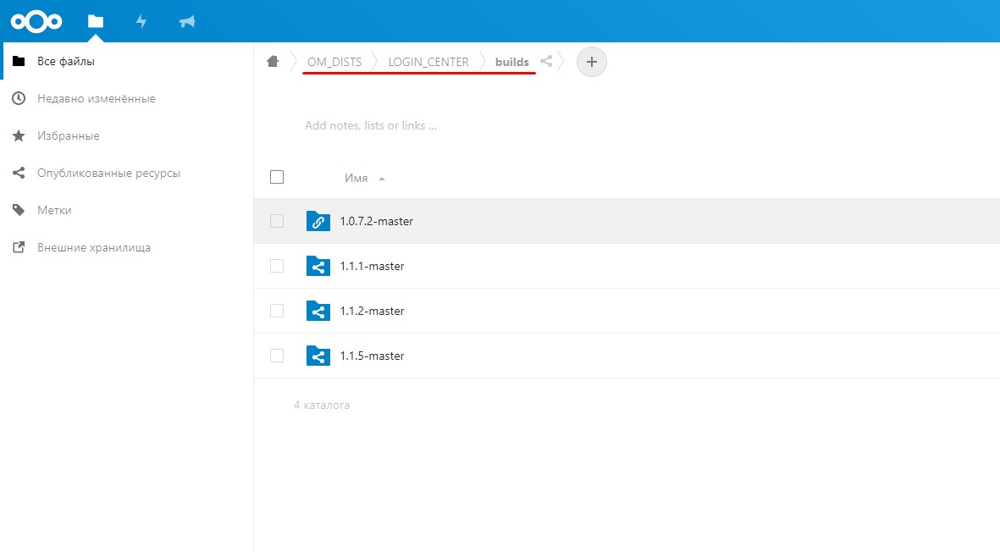
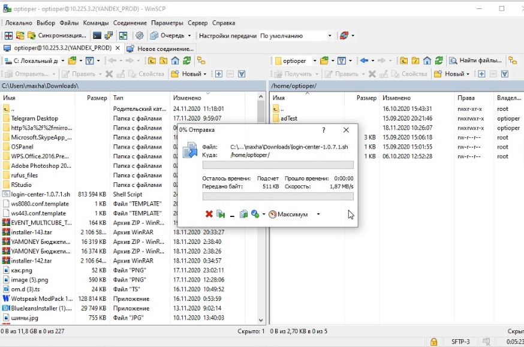
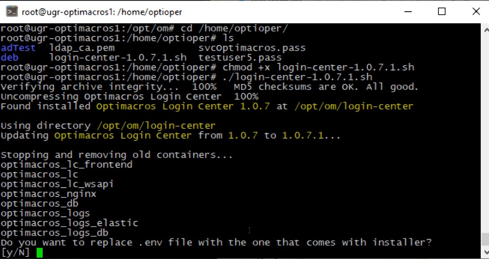
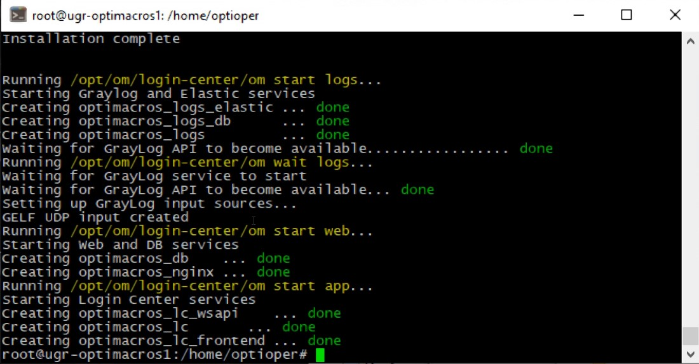
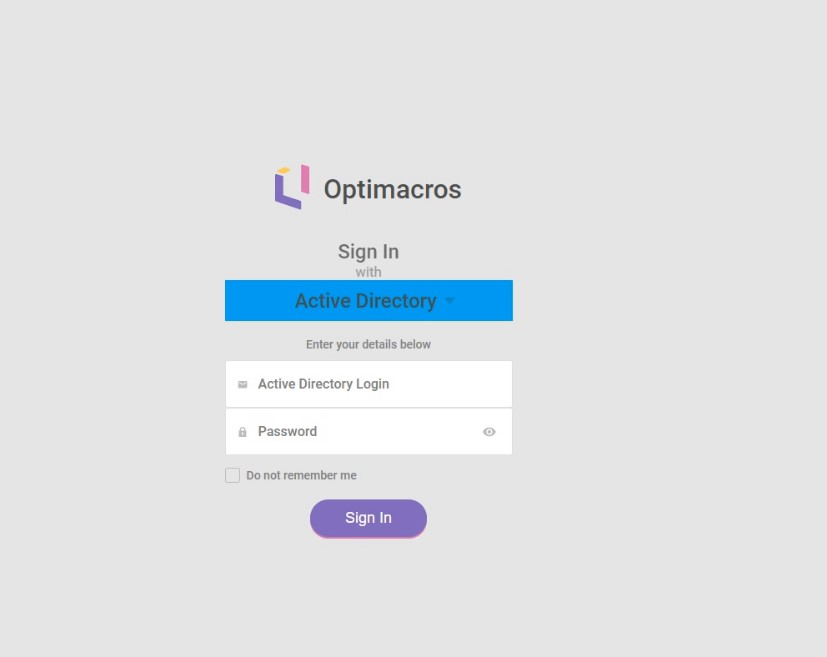
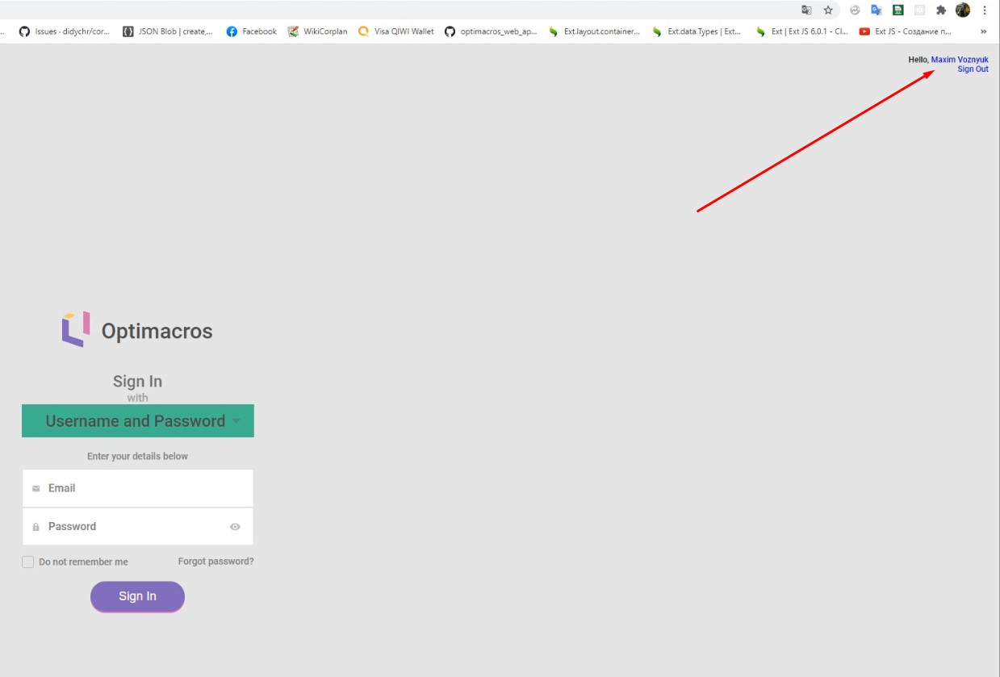
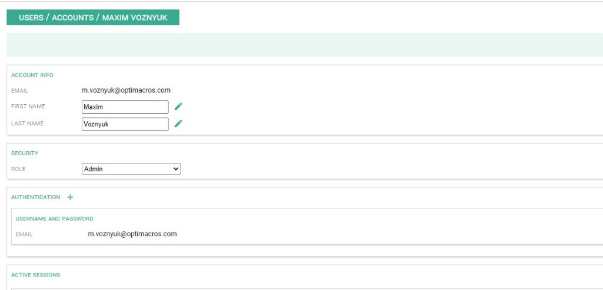
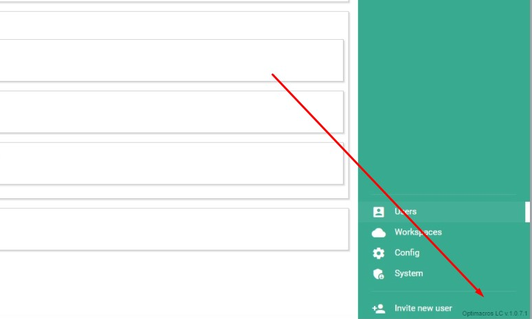

# Обновление уже установленной версии дистрибутива Optimacros:

Рассмотрим пример обновления новой версии Логин Центра Optimacros на клиентском сервере:

Как правило, почти у всех клиентов в целях безопасности, нет прямого доступа к серверу и установка новой версии 
дистрибутива начинается в подключения к сети VPN. В этом отношении у разных клиентов могут быть разные клиенты для 
предоставления VPN доступов FortiClient VPN, Open VPN, Cisco и т.д.

Попав в сеть VPN, мы получаем доступ к серверу на котором установлена старая версия дистрибутива. Далее нам нужно залить
 новую версию дистрибутива на машину, которая находится в VPN сети. Обычно, через FTP соединение. Получить актуальную 
 версию дистрибутива мы можем на облачном хранилище Optimacros в директории:```OM_DISTS/LOGIN_CENTER/builds```

Самая актуальная версия будет в директории с наибольшим по индексу числом в имени:



Далее переходим в директории и скачиваем файл с именем ```login-center-***.sh``` где *** это идентификатор версии.

После чего мы должны залить этот файл со своего компьютера на клиентский компьютер находящийся в VPN сети. Чаще всего 
для этого используется WinSCP клиент.




 
Затем мы должны подключиться к серверу через протокол ssh в основном это делается с помощью Putty, введя логин и пароль 
и перейдя в режим супер пользователя с помощью команды ```sudo su``` Проверяем что дистрибутив залился с помощью команды
```ls``` переходим в директорию ```/om/``` в которой мы увидим директорию установленного Логин Центра 
```login-center```, директорию установленного воркспейса ```workspace1``` и директорию с дистрибутивами 
```workspace-installer```, внутри которой есть две директории ```prev``` и ```current```.


В директории ```prev``` мы можем увидеть файлы предыдущей версии дистрибутива установленной на этом сервере, а в папке 
```current``` будет находиться та которая версия установлена на данный момент.

Далее мы должны будем остановить работу вокрспейса, до того как начнём обновление Логин Центра.
Переходим в папку инсталляторами воркспейса
```cd /om/workspace-installer/```
 
И затем останавливаем работу воркспейса с помощью команды:
 
```current/install workspace --path /om/workspace1/manifest.json shutdown```


Если после ввода команды мы увидели в командной строке зелёную строку текста: 

```Load manifest '/om/workspace1/manifest.json'```


Значит мы ввели команду правильно и находимся на верном пути, далее нам нужно ожидать пока создадутся бекапы моделей и 
остановится воркспейс.


По завершению всех операций по остановке работы воркспейса, вывод консоли будет выглядеть вот так:


Далее выходим из директории с инсталляторами воркспейса с помощью команды:

`cd ..`

И затем мы можем приступать к обновлению Логин Центра, всегда лучше всего перестраховаться создав бекап Логин Центра.
Чтобы посмотреть как создать бекап, перейдите в раздел документации: [Резервное копирование Логин Центра](reserveLc.md),
сделайте резервную копию и возвращайтесь обратно к данному руководству.

После того как мы сделали бекап имеющегося состояния Логин Центра, мы можем переходить к его обновлению.

Для того, чтобы обновить Логин Центр, достаточно запустить программу с дистрибутивом, который мы залили на сервер с 
помощью WinScp на начальных этапах руководства. Поэтому далее нам необходимо перейти в домашнюю директорию с помощью 
команды: `cd /home/имяПользователя`. Тут мы увидим залитую нами программу с дистрибутивом с помощью команды `ls` или 
`ls -la`

Затем мы даём дистрибутиву права на запуск с помощью команды: 

```chmod +x login-center-***```

Где *** это номер версии Логин Центра.

После чего мы запускаем установщик `./login-center-***`

Далее инсталлятор задаст вопрос, хотим ли мы перезаписать файл .env?



В данной ситуации, для нас подойдёт вариант выбрать пункт N либо просто подождать 10 сек. и он выберется по дефолту.

Затем ожидаем завершения установки обновлённой версии Логин Центра, выглядеть это будет примерно как на сриншоте ниже:



После этого можно проверить результат в браузере. Переходим на страничку Логин Центра:



После этого можно авторизоваться в Логин Центре. Вводим Логин и Пароль от учётной записи администратора и пытаемся 
войти. Войти у нас не получится, потому как будет попытка входа на воркспейс, но воркспейс у нас всё ещё остановлен.
После попытки входа введён снова в браузере адрес Логин Центра и справа вверху можно будет попасть в сам профиль 
пользователя под которым мы пытались авторизоваться.



После чего мы попадём в Логин Центр, в профиль нашего пользователя.



В нижнем правом углу профиля окна Логин Центра мы можем увидеть текущую версию.



После этого остаётся восстановить работу воркспейса. Переходим в директорию с инсталлятором воркспейса:

`cd /om/workspace-installer`

Далее на нужно запустить команду, которая восстановит все клиентские модели из бекапов и запустит воркспейс:

```current/install workspace --path /om/workspace1/manifest.json up```


После чего следует удостовериться, что вокрспейс поднялся успешно и убедиться у работоспособности Optimacros'а. 
Открываем клиентскую логин панель и авторизуемся под любым пользователем.


На этом обновление Логин Центра завершено.

[Вернуться к содержанию <](contents.md)

[Вернуться к оглавлению <<](index.md)
