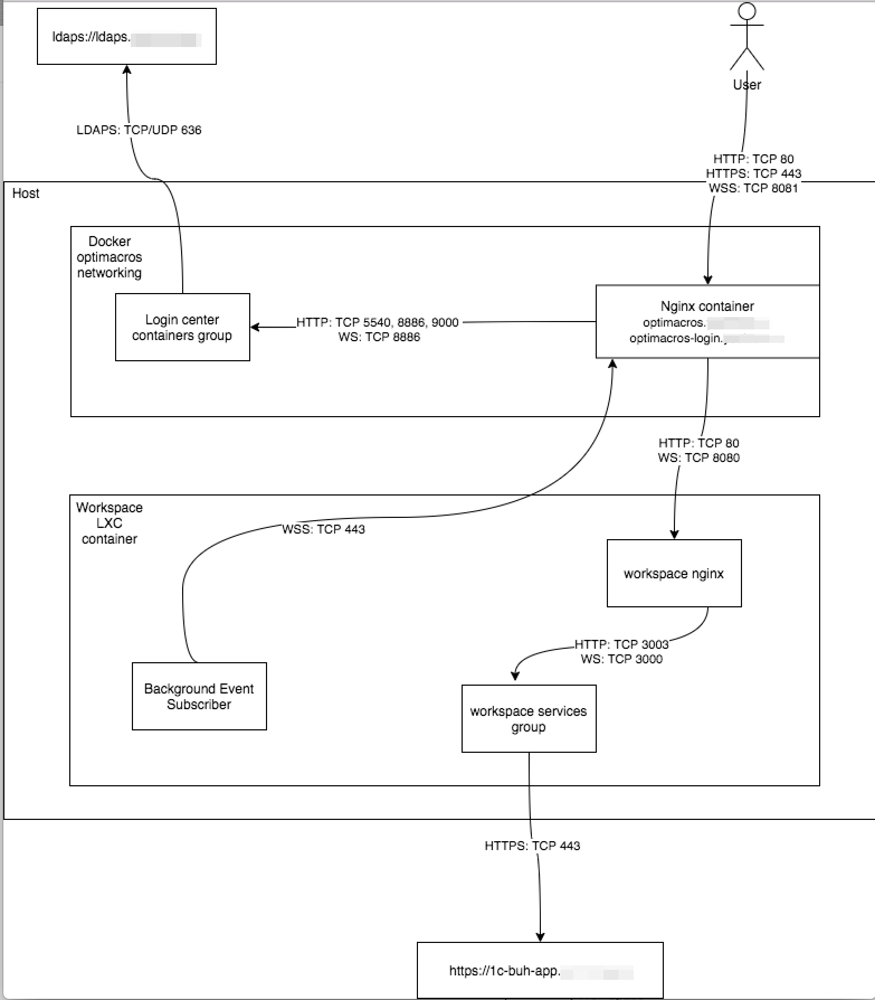

# Схемы внутреннего сетевого взаимодействия Optimacros:

## Вариант 1

На схеме представлено сетевое взаимодействие компонентов Optimacros, 
установленных на одном сервере (Логин центр и один воркспейс), 
а также внешние интеграции:

- Active Directory LDAPS
- 1C Odata Web Service

