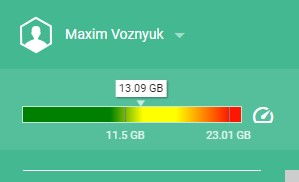

# Формула расчёта счётчика воркспейса:

## Чтобы рассчитать, то какого будет размер воркспейс на счётчике, нужно воспользоваться формулой:



```
const maxSysMem = 1024 * 1024 * 1024 * 16;
let sysMem = memory * 0.25;
if (sysMem > maxSysMem) {
    sysMem = maxSysMem;
}
const workspaceSize = (memory - sysMem) / 2;
```

Где memory это значение, которое в соответствующем поле memory, мы указываем в файле manifest.json


[Вернуться к экспертизе <](expertise.md)

[Вернуться к оглавлению <<](index.md)
